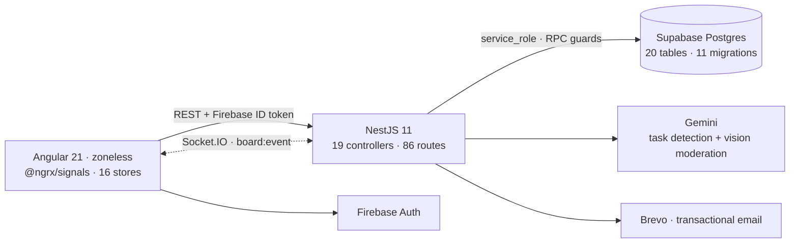

# Horizon Hub Harmony

> A real-time team collaboration board — Trello-style kanban with an LLM that reads team chat and turns "hey @Huy, ship the payment page by Friday" into an assigned card.

<p>
  <a href="https://horizon-hub-harmony.web.app"><b>Live app</b></a> ·
  <a href="https://horizon-hub-harmony-backend-production.up.railway.app"><b>API</b></a>
</p>

<p>
  
  
  
  
  
  
</p>

<!-- Add a screenshot or a short GIF of the board here — it sells the project faster than any paragraph. -->

---

## Engineering highlights

The parts that were actually hard, and what was decided.

### One typed realtime channel instead of 25 event names
The server emits a **single** socket event, `board:event`, discriminated by a `type` field — 25 board-scoped types plus 8 user-scoped ones. Separate event names would mean 25 client listeners, where forgetting one fails *silently*. With one union, a missing branch is a **TypeScript compile error**. The contract is mirrored byte-for-byte in `backend/.../realtime.events.ts` and `frontend/.../realtime.model.ts`.

### Authorization lives in the app, and it's centralized on purpose
The backend talks to Postgres with the `service_role` key, so **RLS is bypassed completely** — the database enforces nothing. Every one of the 86 route handlers must check access itself. That's a copy-paste vulnerability waiting to happen, so all checks funnel through one `AccessService` backed by Postgres RPC functions that resolve `card → board → workspace → org` membership in a single round trip. Access denials return **404, not 403** — a 403 confirms the resource exists.

### AI task detection: a deterministic pre-pass so the model never guesses identity
Sending every message to an LLM is slow and expensive, and letting it infer *who* `H.Thanh` means produces confident wrong answers.

1. A regex gate (`shouldAnalyze`) decides if a message is even worth a model call — a named person, or a verb **and** a time reference.
2. A deterministic Vietnamese name resolver matches full names, `@mentions`, and abbreviations (`H.Thanh` → **H**iệp **Thanh**, `P.Thanh` → **P**hương **Thanh**) via NFD normalization and diacritic stripping.
3. Only then does Gemini get called — with the user IDs **already resolved** and handed to it in the prompt.

The subtle bug this design defends against: after stripping diacritics, `"thanh toán"` (payment) contains `"thanh"`, and `"hoàn thành"` (completed) becomes `"hoan thanh"`. So a bare given name requires an addressing cue (`@`, a trailing comma, or `ơi`) while full names and abbreviations match anywhere.

### Optimistic drag-and-drop that survives concurrent realtime events
Cards move on screen before the API responds. The trap isn't the rollback — it's that a **WebSocket update for a different card can land mid-flight**, and a naive "restore previous state" rollback wipes it out. Rollback is therefore per-entity, and there are dedicated tests for exactly that race.

### Chat with keyset pagination, reply, recall and edit
Cursor pagination on `(created_at, id)` rather than `OFFSET`, because a live feed shifts underneath `OFFSET` and users see duplicated or skipped messages. REST and WebSocket emit the **same** response shape — two mappers had already caused one class of drift bug. Recalled messages never return their content over the wire.

### Fail-closed image moderation
Uploads are scored by Gemini Vision before they're stored. Rejected image hashes are cached in-process so a retry costs no quota; files whose bytes reveal an executable are rejected regardless of extension; animated GIFs are refused outright because the moderation APIs only inspect a single frame.

### Email that works on a host which blocks SMTP
Password reset hung for ~4 minutes and delivered nothing: Railway blocks outbound ports 25/465/587 on its lower tiers, and nodemailer's default timeout is 2 minutes *per resolved IP*. Fixed by moving to a transactional email **HTTPS API**, and wrapping it in a **circuit breaker** so that when mail is down, the frontend degrades to Firebase's own reset flow instead of spinning.

---

## Architecture



**Auth flow:** Firebase Auth issues the ID token → sent on every request → verified by a Nest guard → user upserted into Postgres with `id = firebase_uid`. One identity, no second password store.

**Why not Supabase Realtime?** It enforces RLS, which this backend bypasses by design. Broadcasting from the database would leak rows across organizations. Fan-out happens in a Nest gateway that only emits into rooms the user is authorized to be in.

---

## Stack

| Layer | Choice |
|---|---|
| Frontend | Angular 21 (standalone, signals, **zoneless** — no zone.js), `@ngrx/signals` signalStore + `withEntities`, Tailwind 4, daisyUI 5, GSAP, Lenis |
| Backend | NestJS 11, Socket.IO gateway, `class-validator` DTOs, Jest |
| Data | Supabase Postgres — 20 tables, 11 SQL migrations, permission RPCs |
| Auth | Firebase Auth (Google + email/password), Firebase Admin token verification |
| AI | Gemini — chat→task extraction, vision-based image moderation |
| Integrations | Google Calendar / Google Meet, `.ics` parsing, transactional email |
| Deploy | Firebase Hosting (frontend) · Railway (backend) · GitHub Actions CI |

---

## Features

**Boards** — drag-and-drop lists and cards with FLIP animations, labels, checklists, comments, attachments, due dates, priorities, bulk actions, saved filters, a board minimap, and per-board activity feeds.

**Teams** — organizations → workspaces → boards, three roles (`owner` / `admin` / `member`), expiring invite links, member management, an onboarding tour, and workspace analytics.

**Live** — every board mutation broadcasts to everyone viewing it; assignment, mention, invite and meeting notifications are pushed per user; a global overlay when the network drops.

**Chat + AI** — per-board chat with reply, recall, edit, jump-to-quote and infinite upward scroll; the assistant proposes cards from conversation and every viewer sees the suggestion chip appear and resolve in real time.

**Meetings** — schedule from a card, generate Google Meet links, import Google Calendar events, recurring events, `.ics` export.

---

## Quality

```
624 tests passing  —  494 frontend (Vitest) + 130 backend (Jest)
```

Coverage is aimed at the things that break quietly: optimistic-rollback races, realtime reducers, permission boundaries, the name matcher, `.ics` parsing, moderation rules and the recurrence engine. GitHub Actions runs the frontend suite plus a production build of **both** apps on every PR and every push to `main`.

---

## Running it locally

```bash
# backend
cd backend && npm ci
cp .env.example .env                 # Supabase, Firebase, Gemini, mail keys
npm run start:dev                    # :3000

# frontend
cd frontend && npm ci
cp src/environments/environment.example.ts src/environments/environment.ts
npm start                            # :4200
```

```bash
cd backend && npx jest && cd ../frontend && npx ng test --watch=false
```

Migrations in `backend/migrations/` apply in numeric order. `npm run gieo:demo` seeds a realistic demo workspace and tears it down again with `--xoa`.

---

## Team

Built as a graduation project by four developers over 360 commits.

| Member |
|---|
| [@HaHiepThanh](https://github.com/HaHiepThanh) — Hà Hiệp Thanh |
| [@HuyDino](https://github.com/HuyDino) — Nguyễn Minh Anh Huy |
| [@Fen0633](https://github.com/Fen0633) — Nguyễn Đắc Hoàng |
| [@ngoduchoa113-glitch](https://github.com/ngoduchoa113-glitch) - Ngô Đức Hoà |
